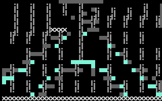
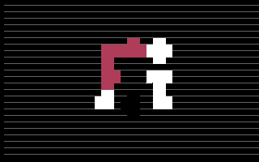
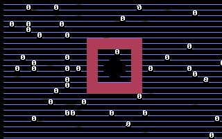
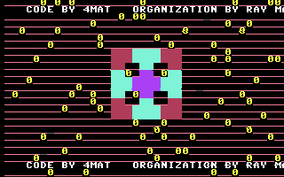
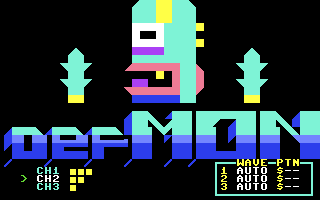

# Entering the secret remix mode

The title screen is secretly a **3×3 pipe puzzle**. Connect the pipes and the
title bursts into a hidden **defMON** music-remix tool, reached with key **9**.

Everything below the "What you actually do" walkthrough is just the player's
view — what is on screen and which keys to press. The "Under the hood" section
at the end explains the machinery, but you never see any of it while playing.

---

## What you actually do

### 1. Play the game and collect the `$` pickups

Press **8** to start the game and grab some **`$`** pickups, then press **SPACE**
to return to the title. Collecting dollar signs is what *arms* the puzzle — just
visiting the game does nothing. Until you have done this, the title tiles barely
move when you press keys; afterwards they rotate freely.



### 2. Rotate the tiles to read the board

Back on the title, the nine tiles are now a live pipe puzzle. Each of the **eight
outer tiles** is rotated by a number key; the **centre tile sets itself**.

```
        ┌─────┬─────┬─────┐
        │  1  │  2  │  3  │
        ├─────┼─────┼─────┤
        │  4  │  ·  │  5  │     ·  = centre tile (automatic)
        ├─────┼─────┼─────┤
        │  6  │  7  │  8  │
        └─────┴─────┴─────┘
          number key  ─►  rotates that tile
```

Pressing a number rotates its tile one step but also drops you briefly into that
tile's app — press **SPACE** to come back to the title and see the board. So the
loop is: **press a number → SPACE → look → repeat** until the pipe is where you
want it. Right now the pipes are scrambled and disconnected:



### 3. Connect the first network (stage 1)

Rotate the tiles until the pipes link up into a connected loop. The moment the
whole board connects, **stage 1 locks in**: the background turns **blue** and the
**centre tile fills in** as a ring. That is your signal the first half is done.



### 4. Connect the second network (stage 2) → the reveal

From the stage-1 shape, only the **four edge tiles — keys 2, 4, 5, 7** — still
need turning; the four corners (keys 1, 3, 6, 8) are already correct. Rotate
those four until the network closes up completely. The instant it does, the
screen **bursts into the red remix / credits screen**:



> *…CODE BY 4MAT — ORGANIZATION BY RAY M…* (a scrolling credit)

### 5. Press 9 for the secret tool

With the puzzle solved, **key 9** is finally live. Press it to drop into the
secret **defMON** music-remix tool. Its three SID channels are live-tweakable
with the global "knob" keys (F1–F7, cursor keys, shifts, C=) — see the per-app
controls in the [README](README.md).



---

## Under the hood

You never see any of the following while playing — it is the machinery the steps
above are driving.

### The three gate variables

| Address  | Role                | What changes it                                              |
|----------|---------------------|-------------------------------------------------------------|
| `$0FFB`  | **arm** counter     | `inc $0FFB` when you eat a `$` pickup (screen-code `$24`); nothing else sets it. |
| `$0FFD`  | **rotation range**  | `#3` at boot; the title's *shuffle* raises it toward **12** while armed. |
| `$0FFE`  | **the gate**        | `#0` at boot → `#1` on the stage-1 match → `#2` on the stage-2 match. |

Key **9** (the defMON tool) only responds once `$0FFE` has reached **2**.

### Why the two steps in the game matter

- **Arming.** The eight outer tiles are rotated by `inc $0FF0,x`, wrapping at
  `$0FFD`. At boot `$0FFD = 3`, so each tile can only cycle through values 1–2 —
  far too few to ever form the target shapes (which need values up to `$0b`).
  Eating `$` pickups makes `$0FFB` non-zero, which unlocks the title's shuffle.
- **Shuffle.** While `$0FFB` is non-zero, each time the title redraws it nudges
  `$0FFD` upward (and spends one `$0FFB`), until `$0FFD = 12`. Only then can the
  tiles reach every rotation the targets need. This is why the tiles feel
  "frozen" before you play and "free" afterwards.

### The two target patterns

Each tile has an internal rotation value 0–11. The gate code compares the whole
grid (`$0FF0`–`$0FF8`, cell order left-to-right / top-to-bottom) against two
fixed targets in sequence:

| Stage | grid `[0 1 2  3 4 5  6 7 8]`   | effect                                             |
|-------|-------------------------------|----------------------------------------------------|
| **1** | `07 02 04  01 00 01  06 02 05` | `$0FFE` 0 → 1, and the **centre `$0FF4` auto-sets to `03`** |
| **2** | `07 0b 04  09 03 08  06 0a 05` | `$0FFE` 1 → 2 → **unlock**                          |

Note only cells 1, 3, 5, 7 (keys **2, 4, 5, 7**) differ between the two stages,
and stage 1 leaves the centre at exactly the `03` that stage 2 requires — which
is why step 4 is just "turn the four edges".

### Why there is no other way in

Scanning every loaded resource for writers of the gate variables:

- **`$0FFB`** is only ever incremented by the game's `inc $0FFB` at `$C604`; its
  own init clears it and the title only decrements it.
- **`$0FFD`** is only `#3` at boot and the title's shuffle `inc`. While it is 3
  the tiles cannot reach the values the targets need.
- **`$0FFE`** is only `#0` at boot, `#1` on the stage-1 match, and `#2` on the
  stage-2 match. Nothing else writes it.

(`$0CAE`, which the dispatcher also treats as a "force secret" flag, is never
written by any code in any bank — it is vestigial.) The single theoretical
exception is a cold boot whose uninitialised `$0FFB` happens to be non-zero; in
practice it boots to `$00`. So the walkthrough above is the whole path.

---

The screenshots here are produced by [`tools/capture.py`](tools/capture.py),
which solves the puzzle for real — every tile rotation is a genuine keypress fed
through the CIA keyboard matrix and the gate is advanced by the cartridge's own
code, not poked. (The one shortcut it takes is arming the board directly instead
of playing the game to collect pickups.)
