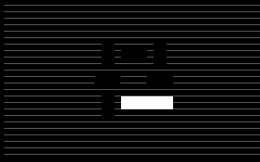
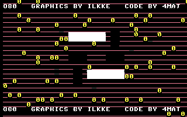

# Entering the secret remix mode

The title screen is secretly a **3×3 pipe puzzle**. Solving it unlocks a hidden
**defMON** music-remix tool on key **9**. The gate is the state byte `$0FFE`: it must
reach **2**, which only happens when the puzzle grid matches two target patterns in
sequence.

There is no shortcut — exhaustive analysis confirms `$0FFE = 2` is *only* written by the
stage-2 puzzle match, the puzzle is only solvable after the grid is "armed", and the
**only** thing that arms it is the game. So the four steps below are the whole path.

---

## Step 1 — arm the puzzle in the game

Launch the game with key **8** and collect the **`$` pickups** (screen-code `$24`).
Each one runs `inc $0FFB` — the single instruction in the entire cartridge that arms the
puzzle. (Just entering the game is not enough; its init clears the counter, so you must
actually grab dollar signs.) Then press **SPACE** to go back to the title.


## Step 2 — the title "shuffles"

Because the arm counter is now non-zero, the title routine raises the tile-rotation
modulus `$0FFD` from 3 to **12**, so the eight outer tiles can now be rotated through
their full range (they were frozen before). Bounce in and out a few times if needed
until it is fully unlocked.

## Step 3 — solve the pipe puzzle ⭐

This is the heart of it. Each of the **eight outer tiles** is rotated by a number key;
the **centre is automatic**. Press a number key to rotate that tile (it briefly shows
that app), then **SPACE** back to the title to see the grid — repeat to rotate further.

```
        grid cell  ─►  rotate with key
        ┌─────┬─────┬─────┐
        │  1  │  2  │  3  │
        ├─────┼─────┼─────┤
        │  4  │  ·  │  5  │     ·  = centre tile (set automatically)
        ├─────┼─────┼─────┤
        │  6  │  7  │  8  │
        └─────┴─────┴─────┘
```

Rotate the tiles so the grid matches the two solved patterns **in order**. The numbers
below are each tile's internal rotation state (cell order, left-to-right / top-to-bottom);
in play you simply rotate each pipe until the network connects:

| Stage | tiles `[0 1 2  3 4 5  6 7 8]` | result |
|-------|------------------------------|--------|
| **1** | `07 02 04  01 00 01  06 02 05` | `$0FFE` 0 → 1, **centre tile auto-sets to `03`** |
| **2** | `07 0b 04  09 03 08  06 0a 05` | `$0FFE` 1 → 2 → **unlock** |

Note only the four edge tiles (keys **2, 4, 5, 7**) change between stage 1 and stage 2;
the corners (keys **1, 3, 6, 8**) are already correct once stage 1 is solved. Completing
stage 1 fills in the centre (`$0FF4 = 03`) for you, which is exactly what stage 2 needs.



## Step 4 — the reveal

The instant the grid matches stage 2, `$0FFE` becomes `2` and the title bursts into the
**remix / credits screen** — and the keyboard scanner now accepts key **9**:



> *…GRAPHICS BY ILKKE — CODE BY 4MAT*

## Step 5 — press 9

With the puzzle solved, **key 9** is finally live. Press it to drop into the secret
**defMON** music-remix tool. Its three SID channels are live-tweakable with the global
"knob" keys (F1–F7, cursor keys, shifts, C=) — see the per-app controls in the
[README](README.md).


---

## Why there is no other way in

Scanning every loaded resource for writers of the three gate variables:

* **`$0FFB`** (arm) — only ever set by the game's `inc $0FFB` at `$C604`. Its own init
  clears it; the title only decrements it.
* **`$0FFD`** (rotation modulus) — only `#3` at boot and the title's shuffle `inc`. While
  it is 3, the tiles can't reach the values the targets need.
* **`$0FFE`** (the gate) — only `#0` at boot, `#1` on the stage-1 match, `#2` on the
  stage-2 match. Nothing else writes it.

(`$0CAE`, which the dispatcher also treats as a "force secret" flag, is never written by
any code in any bank — it is vestigial.) The single theoretical exception is a cold boot
whose uninitialised `$0FFB` happens to be non-zero; in practice it boots to `$00`.
